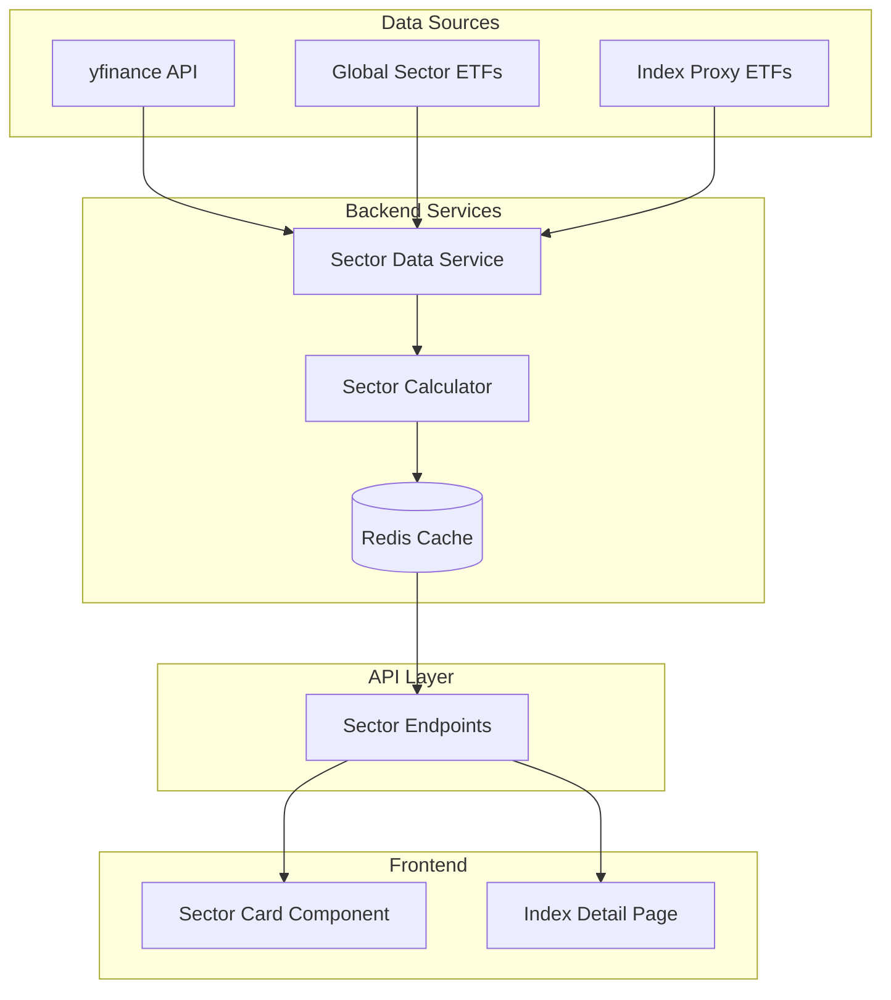

# Sector Analysis Implementation Plan

## Executive Summary

This document outlines the implementation plan for identifying which sectors are positive and negative for each index in the stock analysis system. The solution combines **global sector performance tracking** via sector ETFs with **index-specific sector breakdowns** using ETF proxies.

---

## 1. Solution Architecture Overview



---

## 2. Implementation Approaches

### 2.1 Global Sector Performance (Regional ETFs)

Track sector performance using region-specific sector ETFs:

| Region | Market | Sector ETFs |
|--------|--------|-------------|
| **Americas** | US | XLK (Tech), XLE (Energy), XLV (Healthcare), XLF (Financials), XLY (Consumer Disc.), XLP (Consumer Staples), XLI (Industrials), XLB (Materials), XLRE (Real Estate), XLU (Utilities) |
| **Asia-Pacific** | Japan | 1617.T (Tech), 1519.T (Energy), 1491.T (Financials), etc. |
| **Asia-Pacific** | Hong Kong | 2828.HK (Financials), 2611.HK (Tech), etc. |
| **Asia-Pacific** | India | NIFTY IT (Tech), NIFTY BANK (Financials), NIFTY ENERGY, etc. |
| **Europe** | UK | IQQG.L (Tech), IQQJ.L (Financials), etc. |
| **Europe** | Germany | EXS1.DE (various sectors via MSCI) |

### 2.2 Index-Specific Sector Breakdown

Use index-tracking ETFs to get sector composition:

| Index | Proxy ETF | Source |
|-------|-----------|--------|
| S&P 500 | SPY | yfinance `funds_data.sector_weightings` |
| Nasdaq 100 | QQQ | yfinance `funds_data.sector_weightings` |
| Dow Jones | DIA | yfinance `funds_data.sector_weightings` |
| FTSE 100 | ISF.L / VWRL.L | yfinance `funds_data.sector_weightings` |
| DAX 40 | EXS1.DE | yfinance `funds_data.sector_weightings` |
| Nikkei 225 | 1320.T | yfinance `funds_data.sector_weightings` |
| Nifty 50 | NIFTYBEES.NS | yfinance `funds_data.sector_weightings` |

---

## 3. Data Models

### 3.1 Backend Models (Python/Pydantic)

```python
# backend/app/models/sector.py

from pydantic import BaseModel, Field
from typing import List, Dict, Optional
from datetime import datetime

class SectorPerformance(BaseModel):
    """Individual sector performance data"""
    sector_name: str
    ticker: str
    change_pct: float
    change_pts: float
    is_positive: bool
    
class IndexSectorBreakdown(BaseModel):
    """Sector breakdown for a specific index"""
    index_symbol: str
    sector: str
    weight: float  # percentage of index
    daily_change_pct: float
    contribution_pct: float  # sector's contribution to index movement
    
class GlobalSectorSummary(BaseModel):
    """Global sector performance summary"""
    trade_date: str
    positive_sectors: List[SectorPerformance]
    negative_sectors: List[SectorPerformance]
    neutral_sectors: List[SectorPerformance]
    
class IndexSectorResponse(BaseModel):
    """Complete sector analysis for an index"""
    index_symbol: str
    index_name: str
    trade_date: str
    positive_sectors: List[IndexSectorBreakdown]
    negative_sectors: List[IndexSectorBreakdown]
    sector_count: int
```

### 3.2 Frontend Types (TypeScript)

```typescript
// frontend/src/types/sector.ts

export interface SectorPerformance {
  sector_name: string
  ticker: string
  change_pct: number
  change_pts: number
  is_positive: boolean
}

export interface IndexSectorBreakdown {
  index_symbol: string
  sector: string
  weight: number
  daily_change_pct: number
  contribution_pct: number
}

export interface GlobalSectorSummary {
  trade_date: string
  positive_sectors: SectorPerformance[]
  negative_sectors: SectorPerformance[]
  neutral_sectors: SectorPerformance[]
}

export interface IndexSectorResponse {
  index_symbol: string
  index_name: string
  trade_date: string
  positive_sectors: IndexSectorBreakdown[]
  negative_sectors: IndexSectorBreakdown[]
  sector_count: number
}
```

---

## 4. Backend Implementation

### 4.1 New Service: `backend/app/services/sector_service.py`

```python
# Key functions to implement:

class SectorService:
    """Service for fetching sector performance data"""
    
    # Approach 1: Global Sector Performance
    def get_global_sectors(self, region: str) -> GlobalSectorSummary:
        """Fetch sector ETFs and calculate performance"""
        # 1. Get sector ETF list for region
        # 2. Fetch daily change for each
        # 3. Categorize as positive/negative/neutral
        pass
    
    # Approach 2: Index-Specific Breakdown
    def get_index_sectors(self, index_symbol: str) -> IndexSectorResponse:
        """Get sector breakdown for an index using proxy ETF"""
        # 1. Map index to proxy ETF
        # 2. Get sector weightings from ETF
        # 3. Fetch sector component performance
        # 4. Calculate contribution to index
        pass
    
    def get_all_index_sectors(self) -> List[IndexSectorResponse]:
        """Get sector breakdown for all tracked indices"""
        pass
```

### 4.2 API Endpoints

```python
# backend/app/api/v1/endpoints/sector.py

router = APIRouter()

@router.get("/sectors/global/{region}", response_model=GlobalSectorSummary)
async def get_global_sectors(region: str):
    """
    Get global sector performance for a region
    - region: "americas", "asia-pacific", "europe"
    """
    pass

@router.get("/sectors/index/{symbol}", response_model=IndexSectorResponse)
async def get_index_sectors(symbol: str):
    """
    Get sector breakdown for a specific index
    - Returns positive and negative sectors with weights and contributions
    """
    pass

@router.get("/sectors/all", response_model=List[IndexSectorResponse])
async def get_all_index_sectors():
    """
    Get sector breakdown for all indices
    - Optimized for dashboard overview
    """
    pass

@router.get("/overview/sectors", response_model=dict)
async def get_sector_overview():
    """
    Combined sector overview showing:
    - Which sectors are positive across regions
    - Which sectors are negative
    - Key drivers for each index
    """
    pass
```

---

## 5. Implementation Steps

### Phase 1: Foundation

1. **Add sector models** to `backend/app/models/sector.py`
2. **Create sector ETF configuration** in `backend/app/config.py`:
   ```python
   SECTOR_ETFS = {
       "americas": {
           "technology": "XLK",
           "energy": "XLE",
           "healthcare": "XLV",
           "financials": "XLF",
           # ... etc
       },
       "asia-pacific": { ... },
       "europe": { ... }
   }
   
   INDEX_PROXY_ETFS = {
       "GSPC": "SPY",
       "NDX": "QQQ",
       "DJI": "DIA",
       # ... etc
   }
   ```
3. **Create sector service** in `backend/app/services/sector_service.py`

### Phase 2: Backend Implementation

4. **Implement global sector fetching** using yfinance
5. **Implement index-specific sector analysis** using ETF holdings
6. **Add caching** to sector service (similar to existing market_cache)
7. **Add API endpoints** in `backend/app/api/v1/endpoints/sector.py`
8. **Register new router** in `backend/app/api/v1/router.py`

### Phase 3: Frontend Implementation

9. **Add sector types** to `frontend/src/types/sector.ts`
10. **Create sector API service** in `frontend/src/services/api.ts`
11. **Build SectorCard component** for displaying sector performance
12. **Update IndexDetail page** to show sector breakdown
13. **Add sector overview** to dashboard

---

## 6. Caching Strategy

| Data Type | Cache TTL | Invalidation |
|-----------|-----------|--------------|
| Global sector performance | 1 hour | Manual refresh |
| Index sector breakdown | 1 hour | Manual refresh |
| Sector ETF history | 24 hours | Daily |

---

## 7. Error Handling

1. **ETF not available**: Fall back to individual stock analysis
2. **Partial data**: Return available sectors with warning
3. **API rate limits**: Implement exponential backoff
4. **Missing sector**: Skip and log, don't fail entire request

---

## 8. Performance Considerations

1. **Batch fetching**: Fetch all sector ETFs in parallel using `asyncio`
2. **Lazy loading**: Only fetch index sectors on detail page
3. **Incremental updates**: Cache previous calculations for faster refreshes
4. **Background refresh**: Pre-fetch during low-traffic periods

---

## 9. Future Enhancements

1. **Intra-day sector tracking**: Real-time sector movements
2. **Historical sector analysis**: Trend over weeks/months
3. **Sector correlation**: How sectors move together
4. **Geographic breakdown**: Sector by country within regions
5. **Custom indices**: User-defined index compositions

---

## 10. Summary of Deliverables

| Component | File | Description |
|-----------|------|-------------|
| Backend Models | `backend/app/models/sector.py` | Pydantic models for sector data |
| Sector Config | `backend/app/config.py` | ETF ticker mappings |
| Sector Service | `backend/app/services/sector_service.py` | Core business logic |
| API Endpoints | `backend/app/api/v1/endpoints/sector.py` | REST endpoints |
| Frontend Types | `frontend/src/types/sector.ts` | TypeScript interfaces |
| Sector Component | `frontend/src/components/market/SectorCard.tsx` | UI component |
| Index Detail Update | `frontend/src/pages/IndexDetail.tsx` | Show sector breakdown |

---

## 11. Next Steps

Once this plan is approved:
1. Move to Code mode
2. Begin with Phase 1 (Foundation)
3. Implement backend models and configuration
4. Create sector service with core logic
5. Add API endpoints
6. Update frontend types and components
7. Test and iterate

---

*Plan created: 2026-02-22*
*Version: 1.0*
